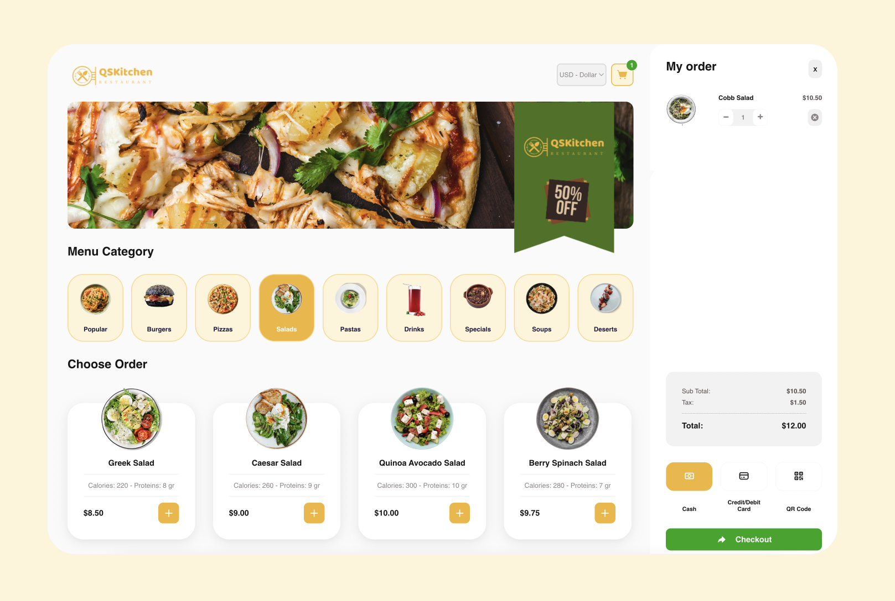
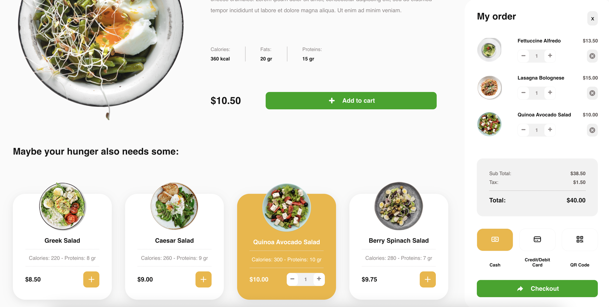

<h1 align="center">
  <br>
  <a href="https://qskitchen-msawaguchi.netlify.app/"></a>
</h1>

<h4 align="center">Restaurant front-end website built with <a href="https://react.dev/" target="_blank">React.js</a>.</h4>

<p align="center">
  <a href="#key-features">Key Features</a> •
  <a href="#how-to-use">How To Install</a> •
  <a href="#technologies">Technologies</a> •
  <a href="#future-enhancements">Future Enhancements</a>
</p>



<h4 align="center"><a href="https://qskitchen-msawaguchi.netlify.app/" target="_blank">Live Preview</a></h4>
<p align="center">
  
</p>

## Key Features

* **Food Filtering**: Allows users to filter the menu by different food categories for easier browsing.
* **Cart Functionality**: Add selected dishes to the cart, view the cart summary, and adjust quantities as needed.
* **Detailed Food Pages**: Each food item has a dedicated details page with a nice feature that suggests related dishes based on the category.
* **Responsive Design**: Provides a consistent and visually appealing experience across all devices, including mobile phones and desktops.
* **State Management**: Utilizes Redux for efficient and scalable state management.
* **Navigation**: Implements React Router for seamless navigation between different sections of the website.
* **Styling**: Employs Styled Components for visually appealing and maintainable styles.
* **Performance Optimization**: Ensures optimized loading times and overall performance.
* **Unit Testing**: Includes unit tests using Jest to ensure the reliability and correctness of components and features.

<p align="center">
  
</p>

## How To Use

To clone and run this application, you'll need [Git](https://git-scm.com) and [Node.js](https://nodejs.org/en/download/) (which comes with [npm](http://npmjs.com)) installed on your computer. From your command line:

```bash
# Clone this repository
$ git clone https://github.com/msawaguchi/qskitchen.git

# Go into the repository
$ cd qskitchen

# Install dependencies
$ npm install

# Run the app
$ npm start
```

## Technologies

- React
- Typescript
- ES6+
- React Hooks
- Redux
- Styled-components
- Jest


## Future Enhancements
Here are some features and improvements planned for future updates:

- [ ] Multi-language Support: Provide language options for a broader audience.
- [ ] Accessibility Improvements: Enhance the website's accessibility features to be more inclusive.
- [ ] Profile Section: Implement user profile management where users can view and edit their personal information.
- [ ] Order History: Add a section for users to view their past orders and track current orders.
- [ ] Search Functionality: Enable users to search for specific dishes by name.
- [ ] Advanced Filters: Include additional filtering options, such as filtering by price range, calories, or dietary preferences.
- [ ] Reviews and Ratings: Allow users to leave reviews and ratings for dishes.
- [ ] Promotions and Discounts: Display ongoing promotions and discounts for certain dishes or categories.
- [ ] More testing: Every component should have a unit test.
